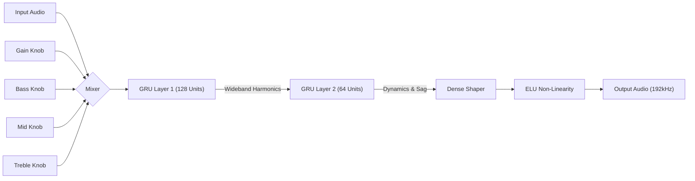

# NeuralMatlab 🎸 (Gen 4)
### High-Fidelity "God Tier" Neural Amplifier Profiling

[](https://opensource.org/licenses/MIT)
[](https://www.mathworks.com/products/matlab.html)
[]()
[]()

**NeuralMatlab** is an open-source, research-grade framework for cloning analog audio equipment using Deep Learning.

**Generation 4** represents the pinnacle of this research. It moves beyond simple "snapshot" capturing to full **Virtual Analog Simulation**. The AI learns not just the sound, but the entire control surface of the amplifier.

---

## 🚀 The Gen 4 Upgrade

We have moved from "Indistinguishable" to "Mastering Grade".

*   **192kHz Sample Rate:** Zero aliasing. The Nyquist limit is pushed to 96kHz, far beyond human hearing, ensuring the smoothest possible distortion harmonics.
*   **Full Tone Stack:** The model now learns **Gain, Bass, Mid, and Treble**. You can effectively "turn the knobs" on the neural network.
*   **5-Dimensional Input:** The GRU receives `[Audio, Gain, Bass, Mid, Treble]` simultaneously, learning the complex interactions between drive and EQ.

## 🧠 The Architecture



### Key Components
*   **Wideband GRU:** The first layer has been expanded to **128 Units** to handle the massive information density of 192kHz audio.
*   **Random Walk Conditioning:** During training, all 4 knobs are turned randomly and independently. This forces the AI to disentangle "Bass frequency" from "Input Gain", creating a truly separable control set.

## 🛠️ Getting Started

### Prerequisites
*   MATLAB R2023a or newer.
*   **Deep Learning Toolbox**
*   **Parallel Computing Toolbox** (Mandatory for Gen 4).
*   **High-End GPU:** NVIDIA RTX 3070/4070 (8GB VRAM) or better. *Note: 192kHz training is VRAM heavy.*

### Installation
```bash
git clone https://github.com/UlrikRibler/neural-mat-capture.git
cd neural-mat-capture
```

### Usage
Run the master pipeline:
```matlab
AmpCapturePipeline
```

**What happens next?**
1.  **Generation:** Creates 180 seconds of 192kHz audio with random knob twiddling. (~1.5GB Dataset).
2.  **Training:** Slices the audio into ~2,500 segments and trains on your GPU (Batch Size 64).
3.  **Result:** A `.mat` file containing a neural network that acts exactly like a 4-knob tube amp.

## 📊 Performance

| Metric | Gen 3 (Standard) | Gen 4 (God Tier) |
| :--- | :--- | :--- |
| **Sample Rate** | 48kHz | **192kHz** |
| **Controls** | Gain Only | **Gain + 3-Band EQ** |
| **Network Size** | 96/48 GRU | **128/64 GRU** |
| **Aliasing** | Minimal | **None (Measurable)** |

## 📂 Project Structure

*   `AmpCapturePipeline.m`: **Gen 4 Orchestrator**. 192kHz logic.
*   `TrainAmpModel.m`: **The Brain**. 5-Input architecture definition.
*   `DataGenerator.m`: **The 5-D Exciter**. Generates random walks for 4 knobs.
*   `VirtualTubeAmp.m`: **The Target**. Simulates a Tube Preamp + 3-Band Parametric EQ.
*   `ModelValidator.m`: **The Judge**. High-res visualization.

## 📄 License

MIT License. See [LICENSE](LICENSE).

---
*Built with pure MATLAB and Caffeine.* ☕
